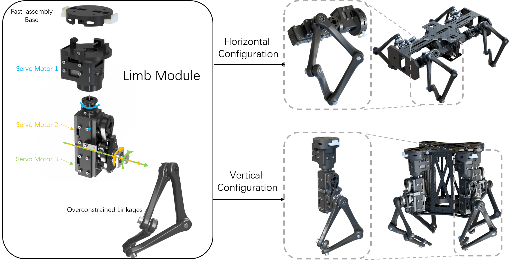
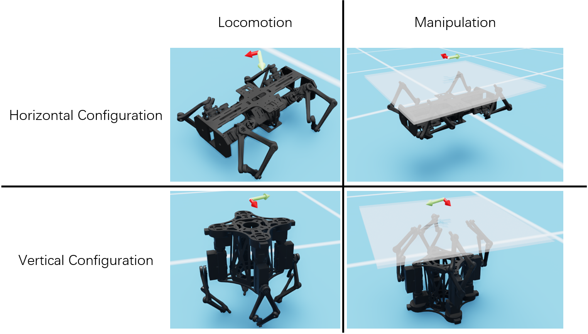

# LocoManipulationRL
The GitHub repo for CORL submission "Bridging Locomotion and Manipulationusing Reconfigurable Robotic Limbsvia Reinforcement Learning"

# Reconfigurable Robot Hardware Design
We designed a 3DoF overconstrained robot module. Based on the module, we designed two series of reconfigurable robots with modules horizontally configured and vertically configured. Both configurations can be used as a quadruped robot for locomotion tasks or a four-fingered gripper manipulation tasks. We also provide a convenient way of converting a custom robot design based on the limb module to the robot model in Isaac Sim, check [Design](Design/) for more information.

# Method Overview

We use a unified loco-manipulation model to formulate locomotion and manipulation tasks. MLP and GNN policies are both used to train loco-manipulation skills.

# Reinforcement Learning of Locomotion and Manipulation Tasks

## Task Definition

