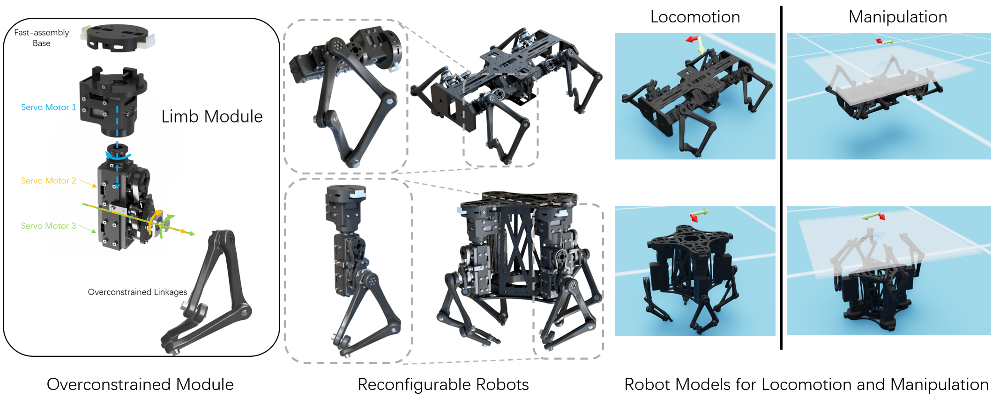
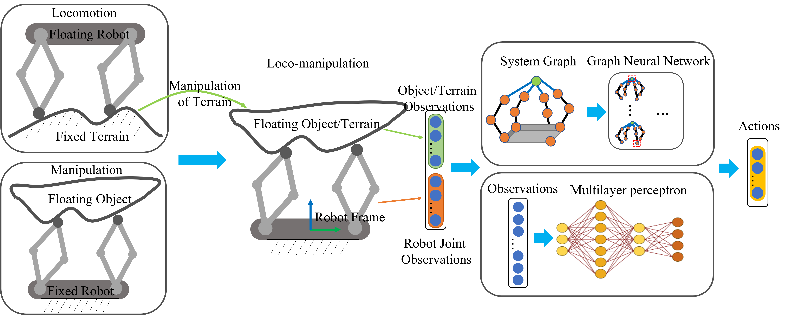
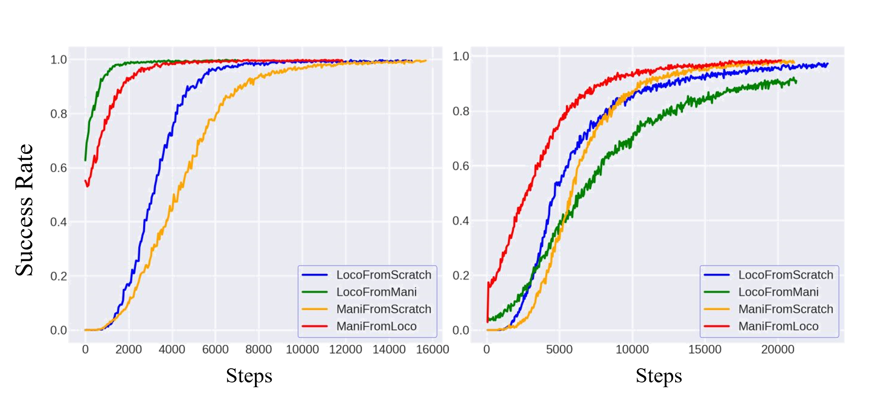

# LocoManipulationRL
The GitHub repo for CoRL submission "Bridging Locomotion and Manipulationusing Reconfigurable Robotic Limbsvia Reinforcement Learning"

# Reconfigurable Robot Hardware Design
We designed a 3DoF overconstrained robot module. Based on the module, we designed two series of reconfigurable robots with modules horizontally configured and vertically configured. Both configurations can be used as a quadruped robot for locomotion tasks or a four-fingered gripper manipulation tasks. We also provide a convenient way of converting a custom robot design based on the limb module to the robot model in Isaac Sim, check [Design](Design/) for more information.

# Method Overview

We use a unified loco-manipulation model to formulate locomotion and manipulation tasks. MLP and GNN policies are both used to train loco-manipulation skills.

# Reinforcement Learning of Locomotion and Manipulation Tasks

## Locomotion and Manipulation Task

As illustrated below, the locomotion task is to control the quadruped robot on flat terrain so that the orientation of the robot base matches the target rotation without a large translation, the marker above the robot indicates the current goal rotation:

In the manipulation task, the robot with the same configuration is inverted with its base rigidly fixed. The goal of the manipulation task is to control the orientation of a flat plate object to match the goal rotation:

## Transferring Learned Policies between Locomotion and Manipulation

Trained Agents with Horizontal Robot Configuration:

 

Trained Agents with Vertical Robot Configuration:

## Co-training Locomotion and Manipulation in a Single Simualtion Environment

