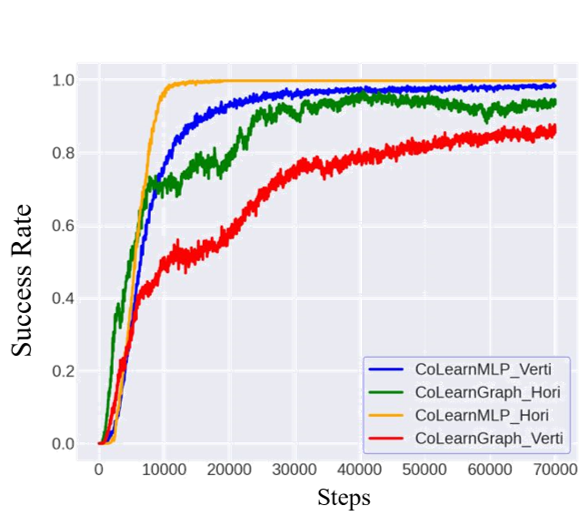

# Bridging Locomotion and Manipulationusing Reconfigurable Robotic Limbs via Reinforcement Learning

https://github.com/bionicdl-sustech/LocoManipulationRL/assets/32815188/0babdefb-866b-4341-9509-984b7e12693a

The GitHub repo for CoRL submission "Bridging Locomotion and Manipulationusing Reconfigurable Robotic Limbs via Reinforcement Learning"

# Reconfigurable Robot Hardware Design
We designed a 3DoF overconstrained robot module. Based on the module, we designed two series of reconfigurable robots with modules horizontally configured and vertically configured. Both configurations can be used as a quadruped robot for locomotion tasks or a four-fingered gripper manipulation tasks. We also provide a convenient way of converting a custom robot design based on the limb module to the robot model in Isaac Sim, check [Design](Design/) for more information.

# Method Overview

We use a unified loco-manipulation model to formulate locomotion and manipulation tasks. MLP and GNN policies are both used to train loco-manipulation skills.

# Reinforcement Learning of Locomotion and Manipulation Tasks

## Locomotion and Manipulation Task

As illustrated below, the locomotion task is to control the quadruped robot on flat terrain so that the orientation of the robot base matches the target rotation without a large translation, the marker above the robot indicates the current goal rotation:

In the manipulation task, the robot with the same configuration is inverted with its base rigidly fixed. The goal of the manipulation task is to control the orientation of a flat plate object to match the goal rotation:

## Transferring Learned Policies between Locomotion and Manipulation

In this setup, locomotion and manipulation are trained separated simulation environments. The performace of locomotion/manipulation trained from scratch and transferred from another task is shown below:

- Trained agents with horizontal robot configuration:

   

- Trained agents with vertical robot configuration:

  

## Co-training Locomotion and Manipulation in a Single Simualtion Environment

In this setup, locomotion and manipulation with the same configuration are trained in a single environment, to learn a unified loco-manipulation policy. The performance of the loco-manipulation task of two robot configurations are shown below:

- Trained agents with horizontal robot configuration (left: MLP Policy; Right: GNN Policy): 

   

- Trained agents with vertical robot configuration:

   

# Sim2Real Transferability

## Sim2Real Transfer Demo:

We found smoother motion of the robot and lower sim2real gap using position PD controller in Isaac Sim and on the physical robot. We test the sim2real transferability using position controller and replay joint position commands from the simulation to the physical robot.

- Locomotion (horizontal configuration):

  https://github.com/bionicdl-sustech/LocoManipulationRL/assets/32815188/a3958df4-ce32-441b-996c-937cb71617cf

- Manipulation (horizontal configuration):
  Coming soon...
  
# Source Codes

Codes and documentations are in [RobotLearning](RobotLearning/)
